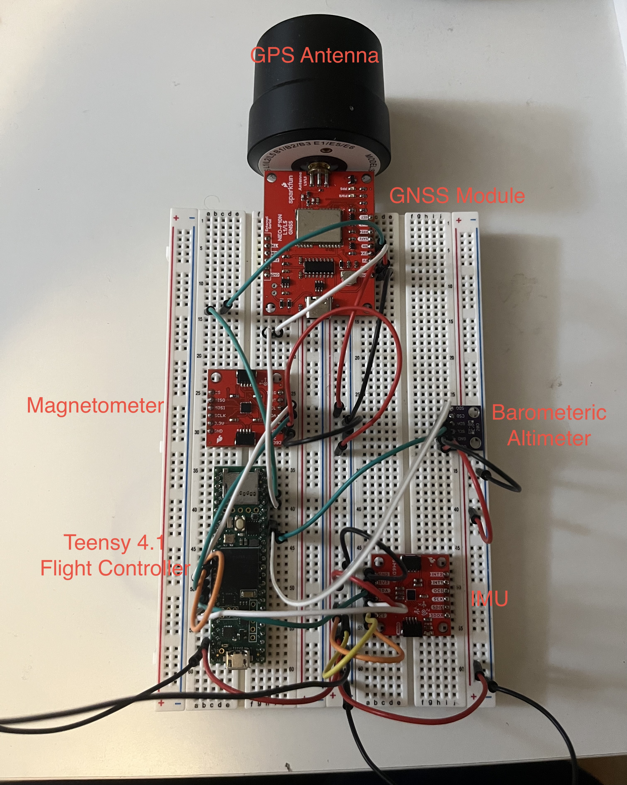

# Active-Flight-Control

## Overview

This codebase started as part of a team Model Rocket Project to learn about Guidance, Navigation, and Communication (GNC). Due to hardware availability and manufacturing issues, I forked it to continue as a personal quadrotor GNC project instead — the fundamental building blocks are similar, like an Attitude Heading Reference System (AHRS), but diverge at critical points like control surfaces (fins vs. rotors). I was the sole code contributor on the original project.

AHRS and PID controllers are currently being developed in MATLAB and Simulink, and may be ported into this repository once validated.

## Hardware

1. Teensy 4.1 - Main Flight Controller
2. MLX90393 - Magnetometer
3. LSM6DSO - Inertial Measurement Unit
4. SparkFun GNSS L1/L5 Breakout NEO-F10N - Global Navigation Satellite System Module (GPS)
5. BMP280 - Barometer (for Altitude)

Breadboarding these Components:

Sensors breadboarded for initial bring-up

## Code

### Guidelines

1. Use constexpr wherever possible instead of macros
2. No manual heap allocations - prevent potential memory leak bugs
3. Class names and structs start with uppercase characters
4. camelCase, not snake_case
5. Filenames use snake_case
6. Use couts, not printf (type safety)
7. Comments should explain why the code exists
8. Document functions if they are complex enough
9. Functions <= 80 lines

### Repository Structure

1. lib/
    - Contains custom libraries or libraries that could not be resolved by PlatformIO's lib_deps
2. src/
    - Contains source code for the logic of each component
3. include/
    - Header files that declare functions and desired globals for each source file
    - Each source file has its own header file to declare components and global variables
4. deprecated/
    - Previous files/systems that were replaced by different files/systems due to updated architecture or other design changes
5. tests/
    - Unit tests or general test files
6. logs/
    - Houses logs generated by the flight controller for analysis
7. assets/
    - Holds other files like images and PDFs - mostly for reports and READMEs
8. designs/
    - Design files such as pinouts, architectural diagrams etc

### Version Control

1. main
    - Deployable, functioning code
2. development
    - All new code/changes are pushed here first to ensure functionality
    - Must PR into main once testing is functional to keep it up to date
3. other
    - Sub-branches of development where individual features are implemented
