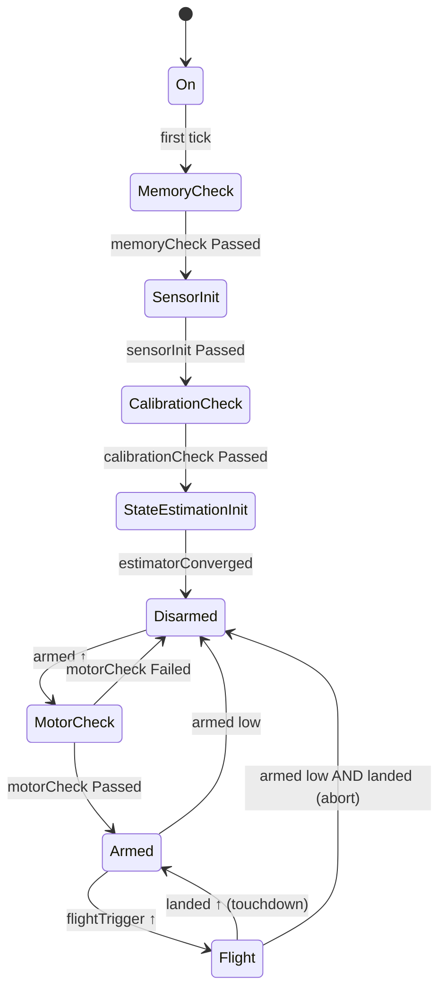
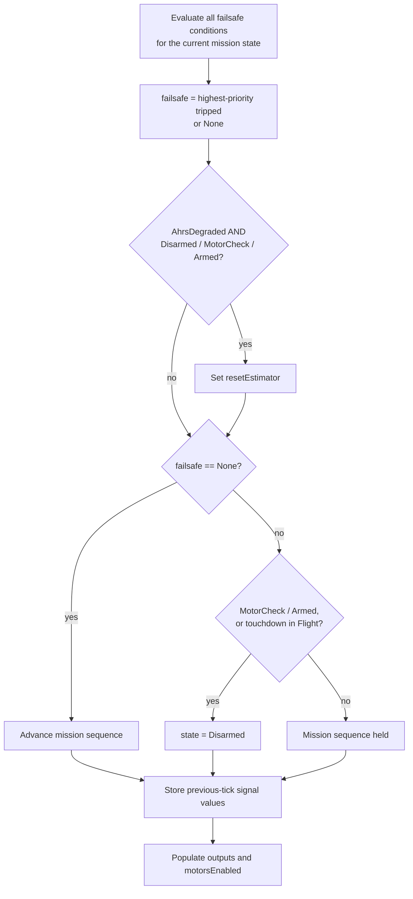

# FlightStateMachine

Determines the permitted behavior of the vehicle at each control-loop tick: boot, arming, takeoff, landing, and fault response. The state machine does not command the vehicle; the controller does. The state machine reports the current mission phase and the actions `main.cpp` must take.

| File | Contents |
| --- | --- |
| `Core/FlightState.h` | Mission states (`On` … `Flight`) |
| `FSM/FlightStateMachine.h` | `CheckResult`, `Failsafe`, configuration/input/output structs, class declaration |
| `FSM/FlightStateMachine.cpp` | Implementation |
| `test/test_flightStateMachine/` | Unity test suite, 28 tests (`pio test -e native -f test_flightStateMachine`) |

---

## Design principles

### Pure logic

The state machine owns no other objects and does not call the estimator, controller, or ESC driver. Each tick:

```cpp
main.cpp populates FsmInputs  ──▶  fsm.step(in)  ──▶  FsmOutputs  ──▶  main.cpp executes requests
```

All information required by the state machine arrives as plain data. All actions it requires leave as request flags. The class is therefore testable without mocks.

### Orthogonal mission state and failsafe

| Variable | Type | Represents |
| --- | --- | --- |
| `state` | `FlightState` | Position in the mission sequence |
| `failsafe` | `Failsafe` | Active fault, if any |

The two variables are independent. `Flight` with `AhrsDegraded` denotes a vehicle in flight under a degraded-attitude descent. A failsafe never overwrites the mission state, so no pre-failsafe state is stored or restored.

### Stateless failsafe selection

The active failsafe is recomputed from all fault conditions on every tick as the highest-priority condition currently tripped. Escalation, de-escalation, and recovery require no dedicated logic.

### Rising-edge triggers

`armed`, `flightTrigger`, and `landed` trigger transitions only on a false-to-true change (rising edge). A signal held high has no further effect. This prevents a signal left high from re-arming, relaunching, or terminating a flight.

---

## Mission sequence



`↑` denotes a rising edge. Mission transitions execute only while `failsafe == None`.

| State | Exit condition | Next state | Requests |
| --- | --- | --- | --- |
| `On` | none (first tick) | `MemoryCheck` | |
| `MemoryCheck` | `memoryCheck == Passed` | `SensorInit` | |
| `SensorInit` | `sensorInit == Passed` | `CalibrationCheck` | |
| `CalibrationCheck` | `calibrationCheck == Passed` | `StateEstimationInit` | |
| `StateEstimationInit` | `estimatorConverged` | `Disarmed` | |
| `Disarmed` | `armed` rising edge | `MotorCheck` | `resetController`, `startMotorCheck` |
| `MotorCheck` | `motorCheck == Passed` | `Armed` | |
| | `motorCheck == Failed` | `Disarmed` | |
| `Armed` | `armed` low (evaluated first) | `Disarmed` | |
| | `flightTrigger` rising edge | `Flight` | |
| `Flight` | `armed` low and `landed` high | `Disarmed` | |
| | `landed` rising edge (touchdown) | `Armed` | `resetController` |

Behavioral notes:

- **Boot check failure is non-latching.** A `Failed` boot check holds the current state with motors disabled. A subsequent `Passed` result resumes the sequence.
- **The estimator is not reset on arming.** The estimator runs continuously from boot; a reset at arming would discard the magnetometer-referenced heading held by Madgwick.
- **`MotorCheck` does not repeat after landing.** `Flight → Armed` bypasses it. A disarm followed by a re-arm repeats it.
- **Disarm is ignored while airborne.** In `Flight`, disarm is accepted only while `landed` is high, covering an aborted takeoff.
- **During `MotorCheck`, motor commands originate from the ESC test routine, not the controller.**

---

## Failsafes

### Definitions

| Failsafe | Priority | Trip condition | Applicable states | Response |
| --- | --- | --- | --- | --- |
| `SensorLoss` | 1 (highest) | accel or gyro `FAILED` | Disarmed, MotorCheck, Armed, Flight | Motors disabled |
| `AhrsDegraded` | 2 | Estimator in complementary-filter fallback | Disarmed, MotorCheck, Armed, Flight | Descent on complementary filter |
| `Altitude` | 3 | Altitude error > `altitudeErrorTol` for longer than `altitudeErrorTimeout` | Flight | Descent |
| `RcLoss` | 4 | No valid RC for longer than `rcLossTimeout`; only if `rcRequired` | Armed, Flight | Descent |

No failsafe is evaluated during boot states; boot-time sensor faults are handled by the boot checks.

The altitude and RC dwell timers reset to zero whenever the condition clears or the failsafe is not applicable in the current state.

### Per-tick evaluation



### Termination

All failsafe paths terminate in `Disarmed` on the ground.

- **Airborne:** descent, then touchdown, then `Disarmed`. `Altitude` and `RcLoss` are not applicable in `Disarmed` and clear on the following tick.
- **On the ground with motors enabled** (`MotorCheck`, `Armed`): immediate transition to `Disarmed`.
- **`AhrsDegraded` on the ground:** `resetEstimator` is requested on the same tick. After the reset, `estimatorDegraded` is false and the failsafe clears. This request is the only mechanism that clears estimator fallback; `StateEstimator` does not recover from fallback autonomously.
- **`AhrsDegraded` airborne:** no estimator reset is requested; the complementary filter remains the attitude source for the full descent.
- **`SensorLoss` in `Disarmed`:** remains active and blocks arming until the sensor status recovers.

---

## Motor enable

| Condition | `motorsEnabled` |
| --- | --- |
| `state` is `MotorCheck`, `Armed`, or `Flight` | true |
| Any other state, including states added later | false |
| `failsafe == SensorLoss` (overrides all of the above) | false |

Descent is commanded by the controller, selected from `out.failsafe`:

| `out.failsafe` in `Flight` | Controller mode |
| --- | --- |
| `None` | Nominal |
| `AhrsDegraded`, `Altitude`, `RcLoss` | Sub-hover descent with attitude control active |
| `SensorLoss` | Not applicable; motors disabled |

---

## Rising-edge rationale

| Level-triggered behavior | Edge-triggered behavior |
| --- | --- |
| Arm signal high at power-up arms at end of boot | Remains `Disarmed` until the signal is cycled |
| After a failsafe disarm, arm signal still high re-arms immediately | Remains `Disarmed` until the signal is cycled |
| After landing, takeoff signal still high relaunches immediately | Remains `Armed` until the signal is cycled |
| `landed` high at takeoff terminates the flight on its first tick | Only a new touchdown terminates the flight |

Previous-tick signal values are updated on every tick, including while a failsafe is active. An edge occurring while a failsafe blocks the transition is consumed and does not trigger the transition after the failsafe clears.

`armed` is additionally evaluated as a level in two transitions: `Armed → Disarmed`, and `Flight → Disarmed` while `landed` is high.

---

## Interface

### `FlightStateMachineConfig`

| Field | Unit | Description |
| --- | --- | --- |
| `altitudeErrorTol` | m | Altitude error threshold that starts the dwell timer |
| `altitudeErrorTimeout` | s | Dwell duration required to trip `Altitude` |
| `rcLossTimeout` | s | Duration without valid RC required to trip `RcLoss` |
| `rcRequired` | bool | `false` disables the `RcLoss` failsafe entirely |

### `FsmInputs`

Default values represent a healthy, idle system.

| Field | Type | Source |
| --- | --- | --- |
| `dt` | float, s | Loop timer |
| `memoryCheck`, `sensorInit`, `calibrationCheck`, `motorCheck` | `CheckResult` | Respective check modules |
| `armed` | bool, level + edge | Operator arm signal |
| `flightTrigger` | bool, edge | Takeoff command |
| `landed` | bool, level + edge | Touchdown detector |
| `estimatorConverged` | bool | `StateEstimator::isConverged()` |
| `estimatorDegraded` | bool | `StateEstimator::isDegraded()` |
| `accelStatus`, `gyroStatus` | `SensorStatus` | Sensor health layer |
| `altitude`, `altitudeSetpoint` | float, m | `StateEstimate`, setpoints |
| `rcValid` | bool | RC link |

### `FsmOutputs`

`resetEstimator`, `resetController`, and `startMotorCheck` are single-tick requests and default to `false`.

| Field | Required action in `main.cpp` |
| --- | --- |
| `state`, `failsafe` | Log; select controller mode from `failsafe` |
| `motorsEnabled` | Command zero output when false |
| `resetEstimator` | Call `StateEstimator::reset()` |
| `resetController` | Call `AttitudeAltitudeController::reset()` |
| `startMotorCheck` | Reset the ESC test result to `Pending` and start the test |

---

## External responsibilities

| Module | Responsibility |
| --- | --- |
| Boot check modules | Own their timeouts; report `Failed` on timeout or error |
| ESC test routine | Reset result to `Pending` on `startMotorCheck`; drive motors during `MotorCheck` |
| Touchdown detector | Report `landed` high when altitude is within ~0.15 m of the ground reference captured at arming, \|vz\| < ~0.2 m/s, and throttle is below hover, sustained for ~0.5 s (thresholds to be tuned) |
| `main.cpp` | Execute request flags after `step()` returns; gate motor output on `motorsEnabled`; select controller descent mode from `failsafe` |

### Integration example

Module names other than the state machine, estimator, and controller are placeholders.

```cpp
FsmInputs in{};
in.dt                 = dt;
in.memoryCheck        = memoryCheck.result();
in.sensorInit         = sensorInit.result();
in.calibrationCheck   = calibration.result();
in.motorCheck         = escTest.result();
in.armed              = rc.armSwitch();
in.flightTrigger      = rc.takeoff();
in.landed             = touchdown.landed();
in.estimatorConverged = estimator.isConverged();
in.estimatorDegraded  = estimator.isDegraded();
in.accelStatus        = readings.accelStatus;
in.gyroStatus         = readings.gyroStatus;
in.altitude           = estimate.altitude;
in.altitudeSetpoint   = setpoints.altitude;
in.rcValid            = rc.valid();

const FsmOutputs out = fsm.step(in);

if (out.resetEstimator)  estimator.reset();
if (out.resetController) controller.reset();
if (out.startMotorCheck) escTest.start();

if (!out.motorsEnabled) { writeMotorsZero(); }
// MotorCheck: escTest drives motors. Armed/Flight: controller, in descent mode if out.failsafe != None.
```

---

## Example sequences

### Nominal flight

| Tick | Event | `state` | `failsafe` | Outputs |
| --- | --- | --- | --- | --- |
| 1–5 | Boot checks pass | On → … → Disarmed | None | Motors disabled |
| 6 | `armed` rising edge | MotorCheck | None | `resetController`, `startMotorCheck` |
| 7 | ESC test passes | Armed | None | Motors enabled |
| 8 | `flightTrigger` rising edge | Flight | None | `landed` still high; no edge, flight continues |
| n | Touchdown | Armed | None | `resetController` |
| n+1 | `armed` low | Disarmed | None | Motors disabled |

### Attitude estimator fault in flight

| Tick | Event | `state` | `failsafe` | Outputs |
| --- | --- | --- | --- | --- |
| 1 | Estimator enters fallback | Flight | AhrsDegraded | Descent; no estimator reset |
| 2 | Gyro `FAILED` | Flight | SensorLoss | Motors disabled |
| 3 | Gyro status recovers | Flight | AhrsDegraded | Descent resumes |
| 4 | Touchdown | Disarmed | AhrsDegraded | Motors disabled |
| 5 | — | Disarmed | AhrsDegraded | `resetEstimator` |
| 6 | Reset complete | Disarmed | None | `armed` still high; no re-arm until cycled |

Tick 3 illustrates de-escalation only. In operation, motors are disabled at tick 2.

---

## Deferred items

| Item | Status |
| --- | --- |
| `BootFailed` latched state | Boot check failures are non-latching; a shared latched state is planned once a check requires hard failure |
| Motor-loss failsafe | Requires ESC RPM telemetry (bidirectional DShot) |
| RC hardware, manual control, airborne kill switch | Not present; `rcRequired = false` |
| `flightTrigger` source | To be defined with RC hardware |
| Touchdown detector | Separate module, not implemented |
